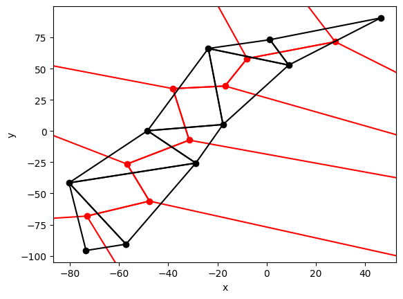

Król Mateusz
## Algorytmy geometryczne 2023/24
# Dokumentacja projektu wieloboki Voronoi
## Spis treści
1. [Część techniczna](#tech)
2. [Część użytkownika](#user)
3. [Sprawozdanie](#report)
    1. [Algorytm Bowyera-Watsona](#bowyer)
    2. [Wykonane testy](#tests)
    3. [Wnioski](#wnio)

&nbsp;
&nbsp;
# 1. Część techniczna 
Program składa się z następujących modułów:
- narzędzie graficzne BITu w folderze ***visualizer***
- funkcje umożliwiające wizualizacje
    1. ***draw_tri***
    2. ***draw_voronoi***
- funkcje generujące zbiory danych
    1. ***generate_uniform_points***
- funkcje pomocnicze 
    1. ***orient***
    2. ***collinear***
    3. ***findCircumCenter***
    4. ***checkPosition***
    5. ***obtuseAngle***
- zdefiniowane klasy wykorzystywane przy implementacji algorytmów
    1. ***Point***
    2. ***Edge***
    3. ***Triangle***
- algorytmy
    1. ***Bowyer-Watson algorithm***
- wizualizacja działania algorytmów

Wymagania techniczne:
- zainstalowana biblioteka ***NumPy***

&nbsp;
&nbsp;
# 2. Część użytkownika 
Większość modułów znajduje się w pliku ***main.ipynb***.
Algorytmy znajdują sie w pliku ***algorithms.py*** i są importowane do ***main.ipynb***
Istnieje również plik ***usefull.py***, który służy do wydzielenia funkcji pomocniczych i zaimplementowanych klas.

Funkcje ***draw_tri*** oraz ***draw_voronoi*** służą do wizualizacji odpowiednio triangulacji Delaunaya oraz diagramu Voronoi za pomocą listy obiektów klasy ***Triangle*** składających się na triangulację Delaunaya odpowiadającą diagramowi Voronoi.

Funkcja ***generate_uniform_points*** służy do losowego generowania chmury punktów na płaszczyźnie.
&nbsp;
&nbsp;
# 3. Sprawozdanie 

W ramach projektu zaimplementowaliśmy dwa algorytmy wyznaczające dla chmury punktów w 2D wierzchołki diagramu Voronoi. 
Umożliwilismy również wizualizację samego diagramu oraz kolejnych kroków algorytmów.
&nbsp;
#### 3.1. Algorytm Bowyera-Watsona 
Algorytm iteracyjny konstruuje triangulację Delaunaya.

Dla każdego nowo-dodanego punktu znajduje trójkąty, których okręgi opisane zawierają ten punkt.
Następnie usuwa znalezione trójkąty z obecnej triangulacji i w powstałej w skutego tego "dziurze" tworzy nowe trójkąty poprzez połączenie krawędziami nowo-dodanego punktu z sąsiednimi wierzchołkami powstałego wielokąta.

Na podstawie triangulacji Delaunaya chmury punktów, jesteśmy w stanie wyznaczyć wierzchołki diagramu Voronoi - są to środki okręgów opisanych na każdym z trójkątów wyznaczonej triangulacji.

Graficzne przedstawienie diagramu Voroni polega na połączeniu ze sobą odcinkami środków okręgów sąsiadujących ze sobą trójkątów oraz poprowadzenie dla pozostałych krawędzi półprostych wychodzących z wierzchołka Voronoi i pokrywających symetralną obecnie rozważanej krawędzi.

&nbsp;

#### 3.2. Wykonane testy 
Przeprowadziłem testy czasowe algorytmu *Bowyera-Watsona* i algorytmu Fortune'a dla różnej ilości losowo generowanych punktów na płaszczyźnie:

| Liczba Punktów | Czas Bowyer-Watson | Czas Fortune |
| --------------- | ------------------ | ------------ |
| 10              | 0.00099778         | 0.03200364   |
| 50              | 0.03199816         | 0.13499832   |
| 100             | 0.05299902         | 0.20900416   |
| 500             | 1.09801841         | 0.91598392   |
| 1000            | 3.40800023         | 1.92497969   |
| 1500            | 7.77997637         | 2.99100327   |
| 2000            | 13.92299891        | 4.09999799   |
| 2500            | 21.87798142        | 5.63699698   |
| 3000            | 32.47299290        | 6.35400343   |
| 3500            | 43.91099811        | 8.97300267   |
| 4000            | 60.44501853        | 8.69200325   |
| 4500            | 78.48697853        | 9.77899957   |
| 5000            | 92.68800616        | 11.12399650  |

, gdzie *n* to moc zbioru punktów na płaszczyźnie
&nbsp;

#### 3.3. Wnioski 

Algorytm *Bowyera-Watsona* w przedstawionej implementacji posiada złożoność O(*n2*). Wynika to z faktu, że dla każdego rozważanego punktu, trójkąty *obecnej* triangulacji są przeszukiwane naiwnie, a więc w zwykłej pętli wykonującej do *n* porównań.

Zaimplementowana wersja algorytmu *Bowyera-Watsona* za każdym razem arytmetycznie sprawdza czy punkt leży wewnątrz odpowiedniego okręgu, co jest zabiegiem niebezpiecznym i nie można zawsze na nim polegać.

&nbsp;
&nbsp;

##### Dane bibliograficzne:
- https://en.wikipedia.org/wiki/Voronoi_diagram
- https://en.wikipedia.org/wiki/Bowyer%E2%80%93Watson_algorithm
- https://github.com/aghbit/Algorytmy-Geometryczne
- https://www.baeldung.com/cs/voronoi-diagram